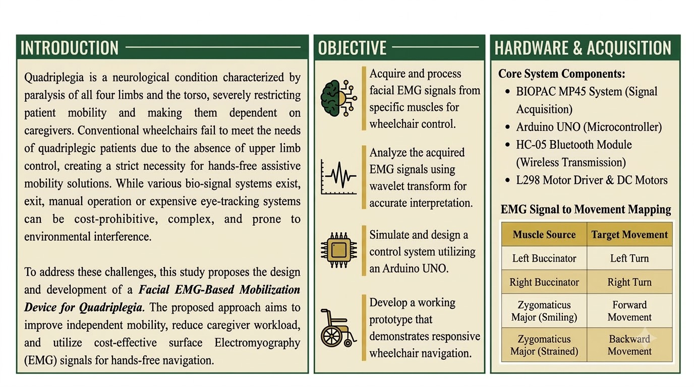
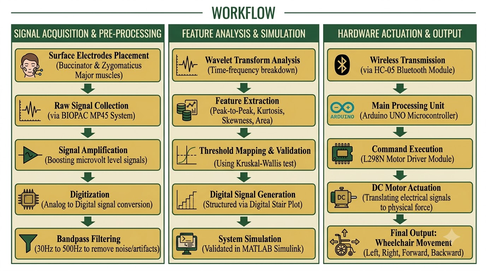
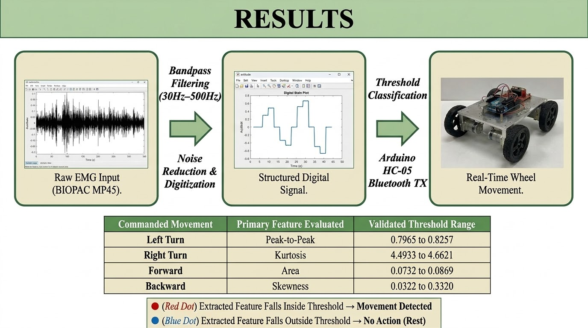

# Facial EMG-Controlled Wheelchair

### A Mobility Assistance System for Quadriplegia

A hands-free assistive mobility system that uses **facial Electromyography (EMG)** signals to control wheelchair movement.

The system captures electrical activity from selected facial muscles and translates intentional facial movements into directional commands, providing an alternative to conventional joystick-based wheelchair control.

---

## Overview

This project focuses on developing a **Facial EMG-Based Mobilization Device** for individuals with quadriplegia.

Surface EMG electrodes are used to acquire signals from facial muscles. The signals are processed, relevant features are extracted, and threshold-based control logic converts the detected facial activity into wheelchair movement commands.

### Core Concept

**Facial Muscle Activity → EMG Signal → Signal Processing → Feature Extraction → Movement Command → Wheelchair Movement**

---

## Key Features

- **Non-Invasive Control** — Uses surface EMG electrodes placed on the facial region.
- **Real-Time Signal Processing** — Uses a 30–500 Hz bandpass filter.
- **Feature-Based Control** — Uses statistical and wavelet-based features.
- **Wireless Communication** — Uses an HC-05 Bluetooth module.
- **Four-Directional Control** — Forward, backward, left and right.

---

## Movement Classification

| Muscle Activated | Target Gesture | Wheelchair Command |
|---|---|---|
| Left Buccinator | Left cheek movement | Left Turn |
| Right Buccinator | Right cheek movement | Right Turn |
| Zygomaticus Major | Smiling | Forward Movement |
| Zygomaticus Major | Strained Expression | Backward Movement |

---

## System Workflow

```text
Facial Muscle Activity
        ↓
Surface EMG Electrodes
        ↓
BIOPAC MP45
        ↓
Amplification & Digitization
        ↓
30–500 Hz Bandpass Filtering
        ↓
Wavelet Transform
        ↓
Feature Extraction
        ↓
Threshold Evaluation
        ↓
HC-05 Bluetooth
        ↓
Arduino UNO
        ↓
L298N Motor Driver
        ↓
DC Motors
        ↓
Wheelchair Movement

---

## Signal Processing

The acquired EMG signals are processed to extract meaningful features for movement classification.

### Processing Pipeline

**Raw EMG Signal → Filtering → Wavelet Analysis → Feature Extraction → Threshold Evaluation**

### Extracted Features

- Peak-to-Peak Amplitude
- Kurtosis
- Skewness
- Signal Area
- Wavelet Coefficients

The extracted features are evaluated against predefined threshold boundaries for classification of distinct facial movements.

---

## Hardware & Software

### Hardware

- BIOPAC MP45
- Surface EMG Electrodes
- Arduino UNO
- HC-05 Bluetooth Module
- L298N Motor Driver
- 12V 1.3AH SLA Battery
- DC Motors
- 4WD Prototype Chassis

### Software

- MATLAB
- Simulink
- Arduino C
- SoftwareSerial Library

---

## Results & Validation

The developed prototype was tested for four-directional movement:

**Forward • Backward • Left • Right**

The system demonstrated conversion of facial EMG activity into directional movement commands and their execution through the motor-control system.

The **Kruskal–Wallis test** was used to evaluate the extracted features for distinguishing between different facial gestures.

---

## Project Posters

### Introduction



### System Workflow



### Final Results



---

## Project Team

**Srinitha S**  
**Nivedha E**  
**Ramya Bharathi S**

Department of Biomedical Engineering  
Vels Institute of Science, Technology and Advanced Studies (VISTAS), Chennai

---

## Citation

```bibtex
@bachelorsthesis{srinitha2025facialemg,
  author       = {Srinitha S and Nivedha E and Ramya Bharathi S},
  title        = {Facial EMG Controlled Wheelchair – A Mobility Assistance for Quadriplegia},
  school       = {Vels Institute of Science, Technology and Advanced Studies (VISTAS)},
  year         = {2025},
  type         = {B.E. Biomedical Engineering Project Phase II Report}
} 
